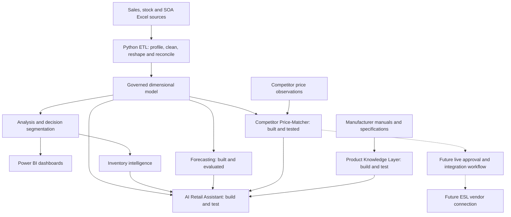
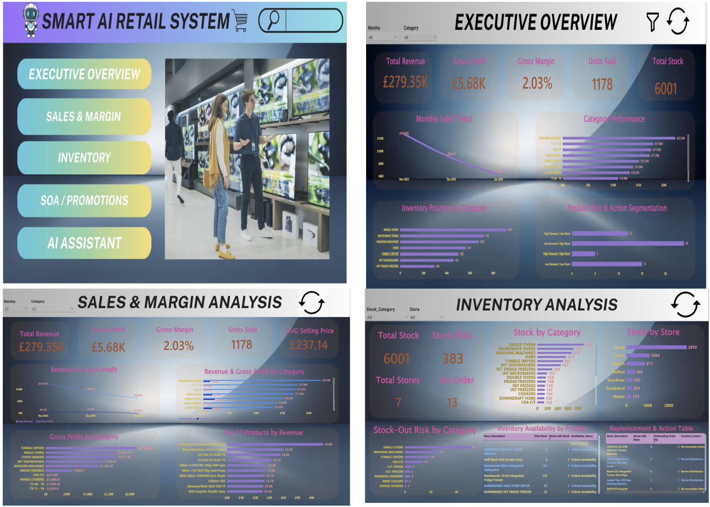
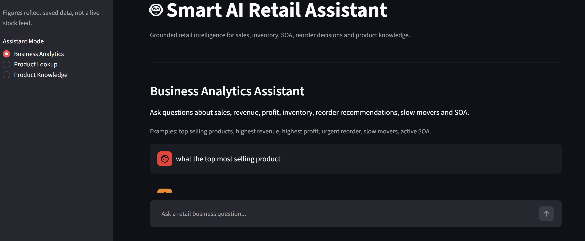

Smart AI Retail System

**An end-to-end retail decision intelligence platform connecting governed data, business intelligence, inventory recommendations, forecasting, competitive pricing and AI-assisted product knowledge.**

Transforming fragmented retail spreadsheets into a shared analytical foundation that helps management understand performance, purchasing teams prioritize stock decisions, and store staff access reliable product information.

> **Current progress:** Phases 0–5 are completed. Phase 6 forecasting has been built and evaluated using the available data. Phase 7 Competitor Price-Matcher has been built and tested. Phase 8 AI Retail Assistant and Product Knowledge Layer are being built and tested. Live Electronic Shelf Label (ESL) integration remains future scope.

## Project Overview

The Smart AI Retail System is a portfolio project spanning **data engineering, analytics engineering, business intelligence and AI engineering**. It combines sales, stock-on-hand and Sell-Out Allowance data to support commercial and operational decisions through a governed data model.

The project follows a connected progression: establish trustworthy data, explain business performance, translate analysis into recommendations, and extend those capabilities through pricing automation and grounded AI interfaces. Dashboards and downstream intelligence share product definitions and business rules so that users can interpret results consistently.

The intended business value is faster identification of stock and margin risks, more consistent pricing reviews, and easier access to product knowledge. These are project objectives; measured commercial uplift and production deployment are not claimed.

## Business Problem

Retail teams often work with separate spreadsheets for sales, inventory and promotions. Different product identifiers, reporting periods and data structures make apparently simple questions difficult to answer reliably.

| Business challenge                                        | Decision the system supports                                                                |
| --------------------------------------------------------- | ------------------------------------------------------------------------------------------- |
| Fragmented sales and profitability reporting              | Which products and categories drive revenue and gross profit?                               |
| Inventory spread across locations                         | Where is stock concentrated, unavailable or potentially excessive?                          |
| Inconsistent identifiers and calculations                 | Can sales, stock and promotions be compared without unreliable joins?                       |
| Slow identification of stock risks                        | Which products need replenishment or slow-mover review?                                     |
| Manual competitor price checks                            | Which comparable products warrant a pricing review within margin constraints?               |
| Product information scattered across manuals and websites | Can staff retrieve specifications for the correct product variant with supporting evidence? |

The foundational challenge is reconciling the data before using it to make recommendations or generate AI answers.

## Project Objectives

- Create a governed, reconciled analytical model from operational Excel sources.
- Establish consistent product identifiers, KPI definitions and data-quality rules.
- Explain sales, profitability and inventory performance through actionable analysis and Power BI.
- Generate transparent inventory recommendations using sales velocity, stock and product importance.
- Evaluate forecasting in proportion to the available historical evidence.
- Compare competitor prices through reliable product matching and commercially constrained recommendations.
- Build an AI Retail Assistant grounded in governed business data and verified product information.
- Prepare an approval-controlled path to future live pricing and ESL integration.

## End-to-End Architecture



The diagram shows the architectural direction as well as current components. Connections to the assistant are being developed and tested; dotted connections represent future live integration.

## Source Data

| Source                        | Content                                                                                                                                                                         | Engineering consideration                                                                                              |
| ----------------------------- | ------------------------------------------------------------------------------------------------------------------------------------------------------------------------------- | ---------------------------------------------------------------------------------------------------------------------- |
| `Master_Sales_data.xlsx`    | Product/category sales, units sold, unit cost, unit price, sales value, cost of sales, profit and stock-level fields; master data plus November, December and January snapshots | Establish period coverage, reconcile financial fields and avoid double-counting overlapping master and monthly records |
| `Stock on Hand Report.xlsx` | Product inventory across Gorey, Dundrum, Cavan, Navan, Blanch, Sandyford and Belfast                                                                                            | Reshape separate store columns into product–store records and reconcile against reported totals                       |
| `Master-SOA.xlsx`           | Product/model, description, SOA value, start date and end date                                                                                                                  | Match products consistently and apply discounts only within their defined validity windows                             |

The build specification also refers to the latter two sources as `Stock_on_Hand_Report.xlsx` and `MasterSOA.xlsx`.

**SOA means Sell-Out Allowance: an additional customer discount valid during a defined date window.** Its applicability depends on the product and the relevant start/end dates. Pricing calculations must distinguish the regular selling price from the effective customer price and avoid applying the discount twice. SOA is not assumed to reduce unit cost or represent supplier reimbursement.

The available sales history consists of a limited set of monthly snapshots. Promotion validity windows are not a substitute for observed sales history, and a stock snapshot does not establish historical stock movements.

## Methodology

The project combines business problem solving with incremental engineering delivery.

| Framework                                                     | Application                                                                                                                                                                           |
| ------------------------------------------------------------- | ------------------------------------------------------------------------------------------------------------------------------------------------------------------------------------- |
| **DMAIC — Define, Measure, Analyze, Improve, Control** | Define retail decisions and requirements; establish trustworthy data and KPIs; analyze drivers and risks; build decision-support capabilities; plan monitoring and sustained controls |
| **Agile**                                               | Deliver reviewable phases, prioritize a backlog and use feedback to refine subsequent functionality                                                                                   |
| **SDLC**                                                | Connect requirements, architecture, implementation, testing, release planning and maintenance                                                                                         |
| **Data/AI lifecycle**                                   | Progress from ingestion and validation to analysis, model evaluation, grounded AI testing and future monitoring                                                                       |

Delivery gates separate a working prototype from a capability ready for live operational use. Completion of a build phase does not imply production rollout or quantified business impact.

## Data Engineering and Governed Dimensional Model

### Data preparation and quality

The governed foundation brings together product mastering, inventory reshaping and financial reconciliation:

- Normalize sales `Stock Code` and inventory/SOA `Model` identifiers into a canonical product key.
- Convert wide store inventory into a long structure containing product, store and quantity.
- Establish the relationship between cumulative sales data and monthly snapshots before consolidation.
- Investigate missing identifiers, duplicate keys, unmatched products, inconsistent dates and negative stock.
- Reconcile derived financial metrics and inventory totals with source values.

Negative inventory is treated as an exception to investigate, rather than silently replaced with zero. Differences between stock reports must be interpreted in light of their reporting dates and coverage.

### Analytical model

| Core table      | Role and grain considerations                                                      |
| --------------- | ---------------------------------------------------------------------------------- |
| `dim_product` | Canonical product identity and descriptive attributes shared across source systems |
| `dim_store`   | Store/location reference for inventory analysis                                    |
| `fact_sales`  | Product sales and financial performance at the supported reporting-period grain    |
| `fact_stock`  | Product–store inventory at the available snapshot grain                           |
| `fact_soa`    | Product discount records associated with defined validity windows                  |

Sales and inventory have different levels of detail. Store-level inventory does not imply store-level sales attribution where that detail is absent from the source. SOA joins also require date-window logic to prevent expired or overlapping records from duplicating results.

This model supports reusable calculations and decision rules across analytics, Power BI and the developing AI layer.

## Analysis and Decision Intelligence

The analysis layer connects performance measures with management actions:

| Analytical lens                        | Business interpretation                                                 |
| -------------------------------------- | ----------------------------------------------------------------------- |
| Revenue and gross-profit contribution  | Identify the products and categories that matter most commercially      |
| Pareto analysis and ABC classification | Prioritize attention according to contribution and inventory importance |
| Sales velocity and stock position      | Identify high-demand/low-stock and low-demand/high-stock combinations   |
| Margin and pricing outliers            | Surface products needing commercial investigation                       |
| Product decision segmentation          | Turn multiple indicators into understandable review priorities          |

Core measures include revenue, cost of sales, gross profit, gross margin percentage, units sold and average selling price. Inventory measures include stock quantity, stocked SKUs, out-of-stock SKUs and negative-stock exceptions.

Ratios must retain their business meaning: gross margin is calculated from aggregate profit and revenue, and sales velocity requires an explicit observation period. Coverage estimates depend on the quality and comparability of demand and stock inputs.

## Power BI Dashboard

**Status: completed — Phase 4.**

The interactive Power BI dashboard presents governed retail data through **Executive Overview, Sales & Margin, Inventory, and SOA/Promotions** pages. It brings together financial performance, category and product contributions, store stock distribution, stock-out risk and product-level decision segmentation.

The dashboard serves as a management decision-support layer, with reusable DAX measures and reconciliation to the governed analytical foundation. Its purpose is to make priorities visible and explainable, from commercial performance to inventory exceptions.



## Inventory Intelligence

**Status: completed — Phase 5.**

Inventory intelligence combines sales velocity, current stock, ABC classification and commercial performance to generate rule-based recommendations. Outputs distinguish replenishment priorities, review cases, slow-moving products and situations requiring no immediate action.

Recommendations support purchasing and operations review; they are not purchase orders. Low stock must be interpreted alongside demand, while high stock requires context about selling velocity and product importance. Thresholds and exception handling make the reasoning inspectable.

The inventory layer can operate independently of forecasting. Forecast outputs should influence replenishment only where their reliability and relevance have been established.

## Forecasting

**Status: built and evaluated using available data — Phase 6.**

Forecasting has progressed beyond planning, with development and evaluation constrained by the limited historical sales data. Its role is to assess whether the available signal can support useful demand estimates and inventory planning.

The evaluation approach favors simple baselines, chronological validation and explicit uncertainty. More complex models require sufficient history and evidence of improvement over an appropriate baseline. MAE and RMSE are relevant error measures; percentage errors need care when actual demand is zero or very small.

This README does not claim a specific winning model, accuracy score or validated seasonal pattern. Longer and more granular sales history is needed before making stronger claims about forecast reliability or operational impact.

## Competitor Price-Matcher and Pricing Intelligence

**Status: built and tested — Phase 7 Competitor Price-Matcher. Live shelf-price integration remains future scope.**

The pricing workstream connects competitor observations with product matching, market-position analysis and business-rule-based recommendations. It demonstrates a pricing decision workflow whose value depends on both technical matching and commercial reasoning.

```text
SOA / product input
    → Competitor price collection
    → Product matching and confidence assessment
    → Comparable-price and market-position analysis
    → SOA validity and margin checks
    → Pricing recommendation with rationale
    → Approval / decision layer
    → Future live ESL integration
```

Pricing decisions must account for current price, effective customer discount, unit cost, competitor price, match confidence and configured margin constraints. A cheaper listing is only useful when it represents the correct model and a comparable offer.

The control design requires uncertain matches and exceptional price changes to receive human review, with below-floor proposals blocked. Competitor sources named in the build scope include Currys, Harvey Norman and Argos; this does not imply that every retailer has an active production connector. Collection methods and source freshness must be validated separately from recommendation logic.

Testing the matcher does not establish that unattended price changes, a live approval service or shelf updates are deployed.

## AI Retail Assistant

**Status: being built and tested — Phase 8.**

The AI Retail Assistant adds a natural-language interface to governed retail information. Its development focuses on making business questions accessible while retaining the definitions and decision rules used by the analytical platform.

Target questions include:

- Which products have strong sales but insufficient stock?
- Which categories contribute the most gross profit?
- Which SKUs need replenishment or pricing review?
- Which products have an active SOA on the selected date?

The intended access pattern uses read-only governed views and approved tools. Grounding, source references, refresh dates and clear handling of unsupported questions are acceptance requirements under development and testing, rather than claims of unrestricted production readiness.

## Product Knowledge Layer

**Status: being built and tested within Phase 8.**

The Product Knowledge Layer extends the assistant toward shop-floor use: identify a product and retrieve reliable specifications from manufacturer information.

The target workflow is model-number lookup, exact product/variant matching, manufacturer manual or specification retrieval, structured extraction, validation and presentation in a staff-facing product card. Barcode/QR lookup is an extension dependent on reliable barcode-to-model mappings and interface validation.

Product records are intended to include dimensions, capacity, energy information, features and accessories where supported by evidence. Source references, retrieval dates, match confidence and missing-field indicators help staff assess reliability. Comparative strengths and limitations should be derived from verified specifications of comparable catalog products.

An uncertain match or missing specification must remain visible; the assistant should not fill the gap with a guessed fact. Retrieval coverage, extraction accuracy and end-to-end answer quality remain part of Phase 8 testing.



## ESL Automation — Future Live Integration Scope

Live Electronic Shelf Label automation has **not been completed**. It is a future integration of approved pricing decisions with an ESL vendor platform.

```text
Validated recommendation → Approval → Vendor API or controlled feed
    → Acceptance / label-update confirmation → Audit record
```

Future work includes selecting the vendor interface, validating product-to-label mapping, enforcing price and SOA expiry controls, handling retries without duplicate changes, and recording confirmed outcomes. Operational authorization and end-to-end testing are required before enabling live updates.

## Technology Stack

| Area                               | Technology / approach                                        | Role or status                                                                                     |
| ---------------------------------- | ------------------------------------------------------------ | -------------------------------------------------------------------------------------------------- |
| Source data                        | Excel workbooks                                              | Operational sales, stock and SOA inputs                                                            |
| Data preparation and analysis      | Python, pandas, NumPy                                        | Cleaning, reshaping, reconciliation and analysis                                                   |
| Analytical storage and modeling    | SQL; dimensional modeling                                    | Governed facts, dimensions and reusable views; the build specification allows SQL Server or SQLite |
| Business intelligence              | Power BI, DAX                                                | Semantic model, KPIs and interactive dashboards                                                    |
| Inventory and pricing intelligence | Python, configurable business rules                          | Recommendations and tested competitor matching                                                     |
| Forecasting                        | Python-based forecasting and evaluation                      | Built/evaluated within available-data constraints                                                  |
| AI application                     | LLM-assisted retrieval and tool-based querying               | Assistant and Product Knowledge Layer under development/testing                                    |
| Product knowledge                  | Manufacturer documents, structured extraction and validation | Evidence-backed product lookup under development/testing                                           |
| Engineering workflow               | Git / GitHub                                                 | Version control and project documentation                                                          |
| Live integration                   | Vendor APIs or controlled feeds                              | Future ESL integration                                                                             |

Specific model providers, application frameworks and production services are not asserted where they are not established in the project context.

## Skills Demonstrated

- **Business analysis:** translating retail problems into requirements, KPIs and decision criteria.
- **Data engineering:** source profiling, ETL, wide-to-long transformations, product mastering and reconciliation.
- **Analytics engineering:** dimensional modeling, grain-aware joins and reusable business definitions.
- **Business intelligence:** Power BI semantic modeling, DAX and management-oriented dashboard design.
- **Decision intelligence:** Pareto/ABC analysis, stock segmentation and explainable inventory rules.
- **Forecasting:** assessing data sufficiency, implementing forecasts and evaluating results within evidence limits.
- **Pricing automation:** competitor product matching, price comparisons and commercially constrained recommendation logic.
- **AI engineering in progress:** grounded querying, product-document retrieval, structured extraction and uncertainty handling.
- **Engineering delivery:** phased development, testing, version control and clear separation of prototypes from deployment scope.

## Governance and Responsible AI

The governed data foundation establishes the basis for reliable decisions. The following principles also guide testing and future deployment:

- **Traceability:** retain source context, reporting periods, transformation rules and KPI definitions.
- **Data quality:** expose unmatched products, negative stock, duplicate records and reconciliation failures.
- **Commercial controls:** apply SOA only within valid windows; evaluate effective customer prices against margin constraints.
- **Human oversight:** route uncertain or exceptional pricing decisions for review before live action.
- **AI grounding:** restrict analytical answers to supported data and product claims to correctly matched evidence.
- **Evaluation discipline:** separate successful prototype tests from evidence of sustained operational reliability.
- **Publication hygiene:** anonymize or aggregate sensitive commercial data and review screenshots before public release.

Production audit trails, access controls, refresh monitoring and model-quality monitoring belong to the remaining deployment and control work. Their inclusion in the architecture is not a claim that all are already operating in production.

## Future Development

1. Complete Phase 8 grounding, product-matching and specification-extraction tests.
2. Expand sales history and reassess forecasting performance across products and periods.
3. Strengthen competitor collection reliability, offer comparability and freshness checks.
4. Validate barcode/QR lookup and broaden manufacturer-document coverage.
5. Implement and test the live approval-to-ESL integration, including expiry handling and outcome confirmation.
6. Complete deployment, access control, scheduled refresh, monitoring and operational acceptance.
7. Measure business outcomes such as review time saved, inventory action effectiveness and pricing-decision quality.

| Phase | Scope                                                    | Current status                                                      |
| ----- | -------------------------------------------------------- | ------------------------------------------------------------------- |
| 0     | Setup and data reconnaissance                            | Completed                                                           |
| 1     | Business problem, scope and requirements                 | Completed                                                           |
| 2     | Data engineering and governed master dataset             | Completed                                                           |
| 3     | Analysis, decision segmentation and forecast feasibility | Completed                                                           |
| 4     | Power BI decision dashboard                              | Completed                                                           |
| 5     | Inventory intelligence                                   | Completed                                                           |
| 6     | Forecasting                                              | Built and evaluated using available data                            |
| 7     | Competitor Price-Matcher / pricing intelligence          | Matcher built and tested; live ESL integration remains future scope |
| 8     | AI Retail Assistant and Product Knowledge Layer          | Being built and tested                                              |
| 9     | Control, deployment and operational monitoring           | Planned                                                             |
